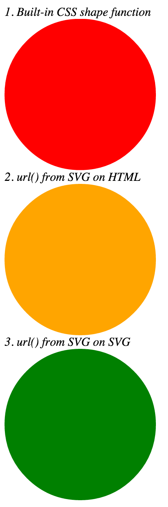

Test files for CSS Masking `clip-path` and `mask-image` support.

# Notes
- Chrome and WebKit [bug with coordinate space]((https://code.google.com/p/chromium/issues/detail?id=417370) when referencing `<clipPath>`from SVG. (workaround: set `-webkit-transform: translate(0,0);` on HTML element).

## Expected result

Fully compliant browsers for `clip-path`

